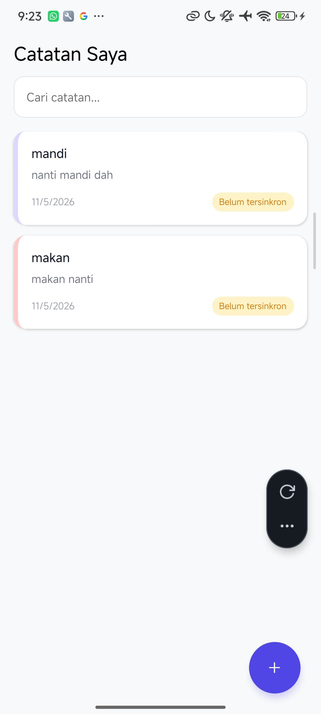
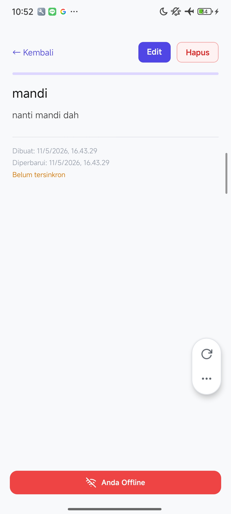
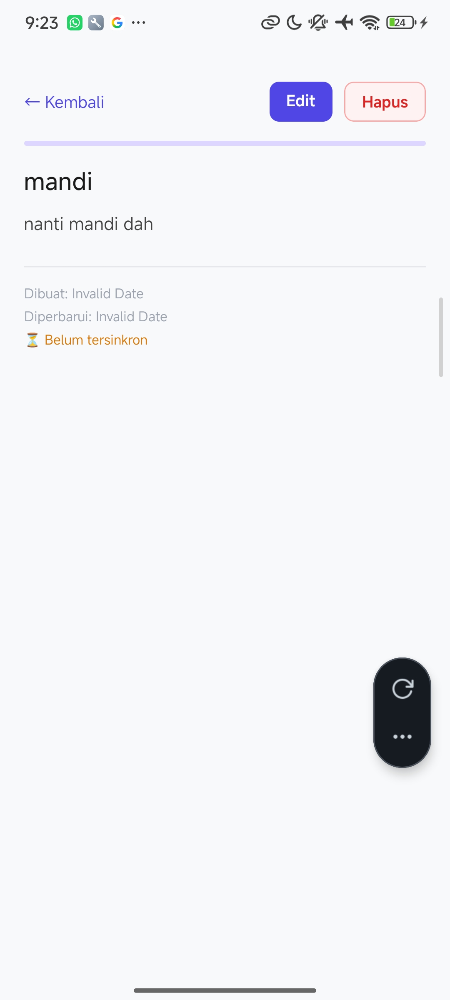
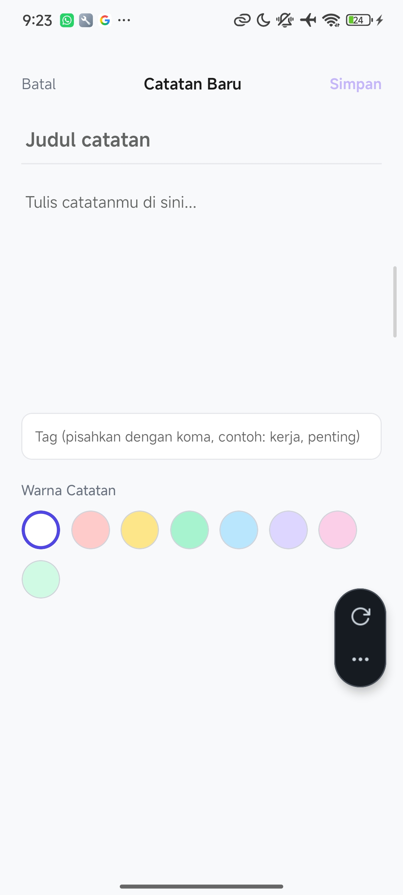

# Notesify - Project Praktikum Pemrograman Mobile Lanjut

**Notesify** adalah aplikasi pencatatan modern berbasis React Native dan Expo yang memungkinkan pengguna membuat, mengedit, mencari, dan mengelola catatan secara offline menggunakan SQLite. Aplikasi ini juga dilengkapi dengan penyimpanan pengaturan menggunakan MMKV, sistem offline detection, serta sync queue sederhana.

---

## Identitas Pengembang

* **Nama**  : Latanza Akbar Fadilah
* **NIM**   : 2410501004
* **Kelas** : Pemrograman Mobile Lanjut - B

---

## Tech Stack

Aplikasi ini dibangun menggunakan teknologi berikut:

* **Framework**: [React Native](https://reactnative.dev?utm_source=chatgpt.com) + [Expo](https://expo.dev?utm_source=chatgpt.com)
* **Database**: [Expo SQLite](https://docs.expo.dev/versions/latest/sdk/sqlite/?utm_source=chatgpt.com)
* **Local Storage**: [React Native MMKV](https://github.com/mrousavy/react-native-mmkv?utm_source=chatgpt.com)
* **State Management**: [Zustand](https://zustand-demo.pmnd.rs?utm_source=chatgpt.com)
* **Persistence Middleware**: Zustand Persist Middleware
* **Network Detection**: [Expo Network](https://docs.expo.dev/versions/latest/sdk/network/?utm_source=chatgpt.com)
* **UI**: React Native StyleSheet API
* **Language**: JavaScript (ES6)

---

## Fitur Utama

### CRUD Notes

* Membuat catatan baru
* Mengedit catatan
* Menghapus catatan
* Menampilkan detail catatan

### SQLite Integration

* Menggunakan SQLite sebagai database lokal
* Implementasi schema database notes
* Mendukung operasi CRUD penuh
* Pencarian notes menggunakan SQL `LIKE`

### Offline First

* Banner offline otomatis muncul saat tidak ada internet
* Status sinkronisasi catatan
* Sync queue sederhana menggunakan MMKV

### MMKV Storage

* Penyimpanan tema aplikasi
* Penyimpanan ukuran font
* Persist state menggunakan Zustand
* Bonus: MMKV encrypted storage

### UI Features

* Color picker untuk catatan
* Tag system
* Floating Action Button
* Search realtime dengan debounce
* Responsive modern UI

---

## Cara Run Project

Pastikan sudah menginstall:

* Node.js
* Expo Go

### 1. Clone Repository

```bash
git clone https://github.com/ltnzz/2410501004-P10-Data-Persistence.git
cd 2410501004-P10-Data-Persistence
```

### 2. Install Dependencies

```bash
npm install
```

### 3. Jalankan Project

```bash
npx expo start -c
```

### 4. Scan QR Code

Buka aplikasi Expo Go lalu scan QR Code yang muncul di terminal.

---

## Dependencies Utama

```bash
npm install expo-sqlite
npm install react-native-mmkv
npm install zustand
npm install @react-native-async-storage/async-storage
npm install expo-network
npm install react-native-safe-area-context
```

---

## Penjelasan State Management

Project ini menggunakan Zustand sebagai state management karena ringan, sederhana, dan mudah dipadukan dengan MMKV persistence.

### App Store

State global digunakan untuk:

* Theme mode (dark/light)
* Font size settings
* Sync queue state

### Persist Storage

State dipersist menggunakan:

* MMKV
* Zustand Persist Middleware

### Encrypted MMKV

MMKV juga diimplementasikan dengan encryption key untuk bonus keamanan data lokal.

---

## Implementasi Offline Banner

Aplikasi menggunakan Expo Network untuk mendeteksi:

* Status koneksi internet
* Internet reachability

Banner akan:

* Muncul saat offline
* Menghilang otomatis saat online
* Memiliki animasi slide dan fade

---

## Implementasi Sync Queue

Sync queue sederhana dibuat menggunakan MMKV untuk menyimpan:

* Pending create
* Pending update
* Pending delete

Queue dapat digunakan untuk implementasi sinkronisasi server di masa depan.

---

## Screenshot

| Home                            | Detail                              | Editor                              | Create                              |
| ------------------------------- | ----------------------------------- | ----------------------------------- | ------------------------------------- |
|  |  |  |  |

---

## Referensi

* [Expo SQLite Documentation](https://docs.expo.dev/versions/latest/sdk/sqlite/?utm_source=chatgpt.com)
* [React Native MMKV Documentation](https://github.com/mrousavy/react-native-mmkv?utm_source=chatgpt.com)
* [Zustand Documentation](https://zustand-demo.pmnd.rs?utm_source=chatgpt.com)
* [Expo Network Documentation](https://docs.expo.dev/versions/latest/sdk/network/?utm_source=chatgpt.com)
* [React Native Documentation](https://reactnative.dev/docs/getting-started?utm_source=chatgpt.com)
